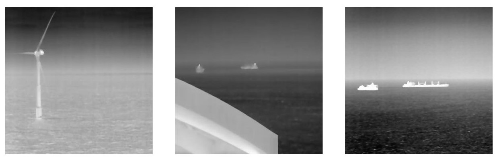
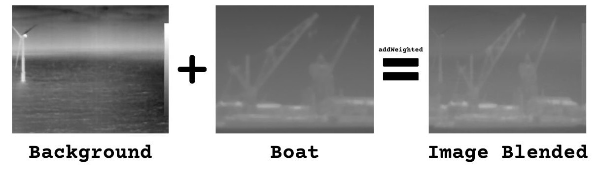
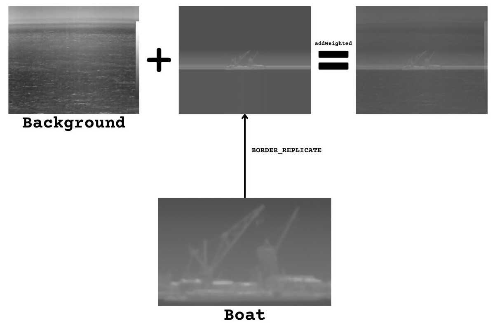
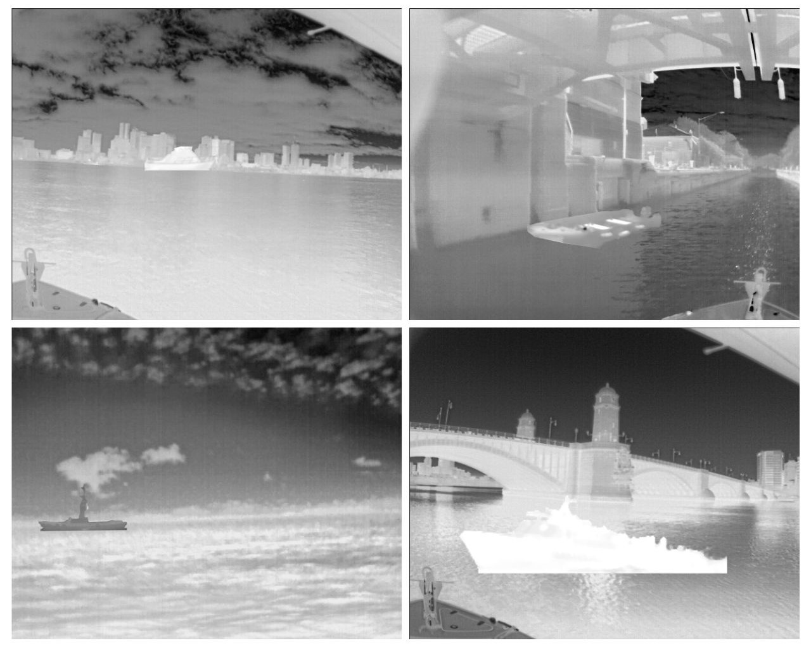

# Object Detection in Maritime Environments with Dual Thermal Optical Camera

Welcome to the repository for the Final Degree Project on Object Detection in Maritime Environments with Dual Thermal Optical Camera. This repository is dedicated to storing and managing the code, data, and documentation related to the project, developed in collaboration with Qualitas Artificial Intelligence and Science S.A.

## Table of Contents

- [Object Detection in Maritime Environments with Dual Thermal Optical Camera](#object-detection-in-maritime-environments-with-dual-thermal-optical-camera)
    - [About This Repository](#about-this-repository)
    - [Structure](#structure)
        - [Image Capture](#image-capture)
        - [Blended OpenCV](#blended-opencv)
        - [Blended OpenCV with Border](#blended-opencv-with-border)
        - [Superposition Cut](#superposition-cut)
    - [Collaborators](#collaborators)
    - [How to start](#how-to-start)
    - [Contribute](#contribute)
    - [Disclaimer](#disclaimer)

## About This Repository

In this repository, you will find a collection of code and images related to the object detection project in maritime environments using a dual thermal-optical camera. Each component is organized in its respective folder and may contain scripts or images necessary for the development and understanding of the project.

## Structure

### Image Capture

Below you can see some examples of images captured in the Mirador environment, with the corresponding code.



### Blended OpenCV

Result of merging two images of the same size with `addWeighted()`.



### Blended OpenCV with Border

The background shows the background image used, while the ship shows the object that is overlaid. The resulting image combines these elements using `addWeighted` after applying `cv2.copyMakeBorder()` to replicate the ship's border.



### Superposition Cut

Composition results of images of ships on seabeds.



## Collaborators

- [Selene](https://github.com/SeleneGonzalezCurbelo)
- [Qualitas Artificial Intelligence Science (QAISC)](https://qaisc.com/)

## How to start
To start working on the project, follow these steps:

1. Clone the repository:
    ```bash
   git clone https://github.com/SeleneGonzalezCurbelo/Object-Detection-in-Maritime-Environments-with-Dual-Thermal-Optical-Camera.git
   ```
2. Open the project in your favorite development environment.
3. Navigate to the corresponding folders and start working on the project. You can start by exploring the data in the Data folder or review the notebooks in Notebooks.

## Contribute
If you want to contribute to this repository, follow these steps:

1. Fork this repository.
2. Create a new branch for your changes: `git checkout -b feature/new-feature`.
3. Make your changes and commit them: `git commit -m "Add new feature"`.
4. Push your changes to your fork repository: `git push origin feature/new-feature`

## Disclaimer

This repository is part of the Final Degree Project (TFG) carried out as part of a university course.
